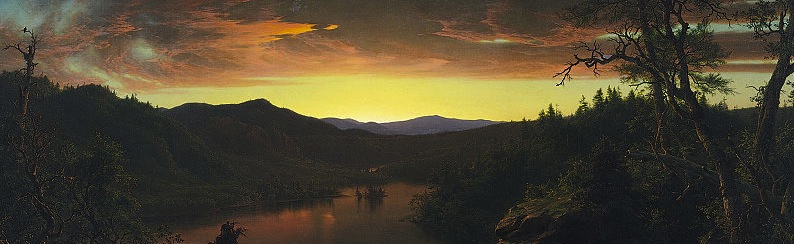

# __ENGLISH 5391__:
##American Literature and Nature
###Representations of Nature and Culture, 1600s-1850s

##Course Description:
This course is a graduate-level introduction to literature from the early-American period to the first decades of the nineteenth century.  In that effort we will also engage in the application of eco-criticism and theory to the body of literature under investigation. 

##Goals:
Over the course of the semester, students will be reading a large variety of texts from the period under investigation and then tease out the ways that ideology and ideological practices of the time effected, and perhaps __affected__, perceptions of reality. Our central goal is to understand the relationships between literary representations of North-American continent and humanity's lived experience as part __of__ nature.

##Book List:

>[__Early American Writings__](http://www.amazon.com/Early-American-Writings-Carla-Mulford/dp/0195118413/ref=sr_1_1?s=books&ie=UTF8&qid=1358367253&sr=1-1&keywords=carla+mulford) -- Carla Mulford (Editor)
>
>[__Shades of Green: Visions of Nature in the Literature of American Slavery, 1770-1860__](http://www.amazon.com/Shades-Green-Literature-American-1770-1860/dp/0820337803/ref=sr_1_1?s=books&ie=UTF8&qid=1358367239&sr=1-1&keywords=ian+finseth) -- Ian Finseth
>
>[__American Curiosity: Cultures of Natural History in the Colonial British Atlantic World__ ](http://www.amazon.com/American-Curiosity-Published-Omohundro-Institute/dp/0807856789/ref=sr_1_1?s=books&ie=UTF8&qid=1358366922&sr=1-1&keywords=susan+scott+parrish) -- Susan Scott Parrish
>
>[__The Journals of Lewis and Clark, 1804-1806__](http://www.amazon.com/Journals-Lewis-Clark-1804-1806-ebook/dp/B0082T2EOG/ref=sr_1_4?ie=UTF8&qid=1358366651&sr=8-4&keywords=lewis+and+clark+journals) --  Meriwether Lewis and William Clark
>
>[__Botanic Manuscript of Jane Colden, 1724-1766__](http://www.amazon.com/Botanic-Manuscript-Jane-Colden-1724-1766/dp/B0007EWSCM/ref=sr_1_3?ie=UTF8&qid=1358366701&sr=8-3&keywords=jane+colden) -- Jane Colden
>
>[__The Travels of William Bartram__](http://www.amazon.com/The-Travels-William-Bartram/dp/1420942492/ref=tmm_pap_title_0?ie=UTF8&qid=1358366749&sr=8-9) -- William Barram
>
>[__Notes on the State of Virginia__](http://www.amazon.com/Notes-State-Virginia-Classic-Reprint/dp/1440099804/ref=sr_1_1?s=books&ie=UTF8&qid=1358367036&sr=1-1&keywords=notes+on+the+state+of+virginia) --  Thomas Jefferson
>
>[__Letters from and American Farmer__](http://www.amazon.com/Letters-American-Farmer-Hector-Cr%C3%A8vecoeur/dp/1420939211/ref=sr_1_1?s=books&ie=UTF8&qid=1358367079&sr=1-1&keywords=Letters+from+and+American+Farmer) -- J. Hector St. John de Crèvecoeur
>
> [__A Narrative of the Yellow Fever in the Year of Our Lord 1793__](http://docsouth.unc.edu/neh/allen/allen.html) -- Richard Allen & Absolom Jones
>
>[__Nature__](http://www.amazon.com/Nature-Other-Essays-Thrift-Editions/dp/0486469476/ref=sr_1_2?s=books&ie=UTF8&qid=1358370811&sr=1-2&keywords=emerson+nature)  -- Ralph Waldo Emerson
>

* __NOTE:__ Most of the books on this list are in the public domain, so it is very likely that some of them are available for free from the [__Project Gutenberg website__](http://www.gutenberg.org/wiki/Main_Page).  For instance, [__The Journals of Lewis and Clark, 1804-1806__](http://www.gutenberg.org/ebooks/8419?msg=dropbox_ok) can be downloaded as a webpage, eBook, or plain-text file.  Feel free to find free electronic versions of the books you will need for class. 

##Requirements:

* __Weekly Reading Assignments__
* __Weekly Blog posts__ --- (500-700 word posts) Posts are due by 9:00am the day of classes
* __Final Project__ --  A "Born Digital" essay of 6000-7500 words, plus media

I would prefer if students used the [Wordpress.com](http://en.wordpress.com/features/) platform for posting blog entries.  The function of the blog posts is to give you a public space to explore ideas that you can share about the literature being read for class.  I intend for the blog posts to be open to the public (Though I would suggest adjusting your settings so that comments are "refereed" before being added to your page).

The last three weeks of class will be an intensive effort to produce a "Born Digital" essay.  By "born digital," we mean an essay that could not exist except in electronic form, otherwise it would not retain the ability to contain or display its content as intended by its creators.  Though students are expected to "turn in" their own individual works, they are nevertheless expected to communicate, brainstorm, collaborate, and be helpful in assisting one another complete their projects.  All of this is in addition to the instructors help and input.  Students should become familiar with the use of [__GitHub__](https://github.com) as a means of maintaining and collaboration for their projects.  Here are some __excellent introductory guides__ for using GitHub:

* [Beginners guide to Git and Github](http://www.webdesignermag.co.uk/features/a-beginners-guide-to-git-and-github/?utm_medium=referral&utm_source=pulsenews) --- The best short introduction to Git and Using GitHub for everyday use by non-programming types (like me)
* [git - the simple guide](http://rogerdudler.github.com/git-guide/) --- An excellent tutorial with __just__ the basics
* [Pro Git](http://git-scm.com/book) --- A full-length, online version of the book which can be purchased on Amazon

Class time will also be dedicated to learning some basic skills to complete the final project. 

----------------------------

----------------------------

###Schedule:

>__Week 1__
>
>Wednesday  --->  Jan 16 ---  __Syllabus and readings assigned__
>
>
------------------------

>__Week 2__
>
>Wednesday  --->  Jan 23 --- Ian Finseth – __Shades of Green: Visions of Nature in the Literature of American Slavery__
>
>  __Blog Posts Will be due by 9:00am__
>
------------------------

>__Week 3__
>
>Wednesday  --->  Jan 30  ---  Cotton Mather –--  “The Negro Christianized”  (Mulford Anthology) 
>
>Jupiter Hammon – Entire section (Mulford Anthology)
>
>Phillis Wheatley – Entire section (Mulford Anthology)
>
> 

>  __Blog Posts Will be due by 9:00am__
>
------------------------

>__Week 4__
>
>
>Wednesday Feb 6 ---  Samuel Sewall – “The Selling of Joseph” (From Mulford Anthology) 
>&
 
>J. Hector St. John de Crèvecoeur --  __Letters from and American Farmer__ 
>
>  __Blog Posts Will be due by 9:00am__
>
------------------------

>__Week 5__
>
>Wednesday  ---  Feb 13 --- John Marrant – “A Narrative of the Lord’s Wonderful Dealings with John Marrant, a Black” (From Mulford Anthology)

>  __Blog Posts Will be due by 9:00am__
>
------------------------

>__Week 6__
>
>Wednesday  ---  Feb 20 --- No Class ---  Thomas Jefferson-- __Notes of the State of Virginia__

>  __Blog Posts Will be due by 9:00am__
>
------------------------

>__Week 7__
>
>Wednesday  ---  Feb 27 --- **No Class**  ---  Richard Allen & Absolom Jones-- [__A Narrative of the Yellow Fever in the Year of Our Lord 1793__](http://docsouth.unc.edu/neh/allen/allen.html)

>  __Blog Posts Will be due by 9:00am__
>
------------------------

>__Week 8__
>
>Wednesday  ---  Mar 6 ---  Susan Scott Parrish - __American Curiosity: Cultures of Natural History in the Colonial British Atlantic World__

>  __Blog Posts Will be due by 9:00am__
>
------------------------

>__Week 9__
>
>Wednesday  ---  Mar 13  --- John Smith—“A Description of New England” (From Mulford Anthology)
 
>& 
 
>Cotton Mather – “Magnalia Christi Americana” (From Mulford Anthology)
>
>  __Blog Posts Will be due by 9:00am__

------------------------

>__Week 10__
>
>Wednesday  ---  Mar 20  ---  Lewis and Clark— __The Journals of Lewis and Clark, 1804-1806__
>
>  __Blog Posts Will be due by 9:00am__
>
------------------------

>__Week 11__
>
>Wednesday  ---  Mar 27  ---  Jane Colden-- __Botanic Manuscript of Jane Colden, 1724-1766__
>
>  __Blog Posts Will be due by 9:00am__
>
------------------------

>__Week 12__
>
>Wednesday  ---  Apr 3 ---	William Bartram -- __Travels of William Bartram__

>  __Blog Posts Will be due by 9:00am__
>
------------------------

>__Week 13__
>
>Wednesday  ---  Apr 10  --- Ralph Waldo Emerson -- __Nature__

>  __Blog Posts Will be due by 9:00am__
>
------------------------

>__Week 14__
>
>Wednesday  ---  Apr 17  ---  Workshop on Born Digital Project

>  __Blog Posts Will be due by 9:00am__
>
------------------------

>__Week 15__
>
>Wednesday  ---  Apr 24  --  Workshop on Born Digital Projects

>  __Blog Posts Will be due by 9:00am__
>

------------------------

> __Week 16__
>
>Wednesday  ---  May 1  --- __Born Digital Projects are due to "go live" by 9:00am for grading and display on the internet__
>

-------------------------------

-------------------------------